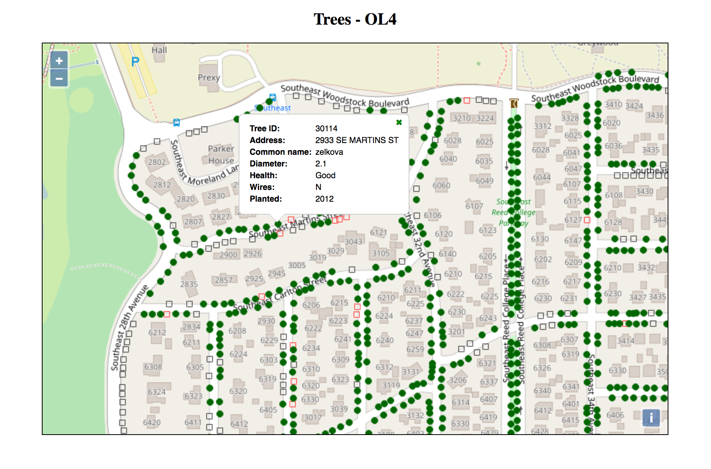

# OpenLayers 4 - pop-ups with layer-dependent content

This is an example of how to get pop-ups with layer-dependent content working for 3 vector layers on desktop and mobile devices. I use this code in our [street tree website](http://streettrees.eastmoreland.org) (check the map at the bottom of the List & Map tab.  

I spent a fair amount of time figuring out how to move from Openlayers 2 to 4.01 and thought that this example might save time for others with a similar need.  I've also included my script for an OL4 build.

The starting point is the OpenLayers example, [Popup](http://openlayers.org/en/latest/examples/popup.html).

Two items to note for mobile devices:

1. Use ol.has.TOUCH to check for mobile devices.  If true,  the hitTolerance is bumped when checking the 'singleclick' event.

       var feature = map.forEachFeatureAtPixel(evt.pixel,
              function(feature) {
                  return feature;
              }, {hitTolerance: hitTolerance});

2. The layer name is used to assemble the pop-up content.  When the hitTolerance is increased, the call to map.forEachLayerAtPixel() can fail because the event pixel may not be the feature pixel.  The fix is to use the feature coordinates instead.

       var coordinates = feature.getGeometry().getCoordinates();
       var pixel = map.getPixelFromCoordinate(coordinates);
       var layer = map.forEachLayerAtPixel(pixel, function(layer) {
             return layer;
       });
 
